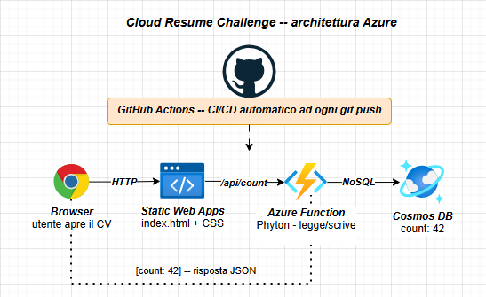

# Cloud Resume — Diego Servadio

> CV online con architettura cloud completa: frontend statico, backend serverless e database NoSQL. Ogni visita incrementa un contatore reale su Azure Cosmos DB.

🌐 **Live:** [brave-water-002bf0303.7.azurestaticapps.net](https://brave-water-002bf0303.7.azurestaticapps.net)

---

## Architettura



Ogni volta che un utente apre il CV, una Azure Function legge il documento su Cosmos DB, incrementa il campo `count` e restituisce il valore aggiornato in pagina.

---

## Stack

| Layer | Tecnologia |
|-------|-----------|
| Frontend | HTML5 / CSS3 |
| Backend | Azure Functions (Python 3.11) |
| Database | Azure Cosmos DB for NoSQL — piano Serverless |
| Hosting | Azure Static Web Apps — piano Free |
| CI/CD | GitHub Actions — deploy automatico su ogni push a `main` |

---

## Struttura del progetto

```
cloud-resume/
├── frontend/
│   └── index.html          # CV — HTML/CSS puro
├── api/
│   ├── counter/
│   │   ├── __init__.py     # Azure Function — logica contatore
│   │   └── function.json   # binding HTTP trigger
│   ├── host.json
│   └── requirements.txt
├── staticwebapp.config.json
├── .github/
│   └── workflows/
│       └── deploy.yml      # CI/CD pipeline
└── README.md
```

---

## Come funziona il CI/CD

Ogni `git push` su `main` attiva automaticamente la GitHub Action che:
1. Esegue il checkout del codice
2. Builda e deploya il frontend su Azure Static Web Apps
3. Deploya le Azure Functions (Python) come backend serverless

Nessun deploy manuale necessario.

---

## Variabili d'ambiente

Le credenziali Cosmos DB sono configurate come Application Settings nella Static Web App e non sono mai nel codice:

| Variabile | Descrizione |
|-----------|-------------|
| `COSMOS_ENDPOINT` | URI dell'account Cosmos DB |
| `COSMOS_KEY` | Primary key dell'account Cosmos DB |

---

## Ispirazione

Progetto ispirato al [Cloud Resume Challenge](https://cloudresumechallenge.dev/) di Forrest Brazeal.

